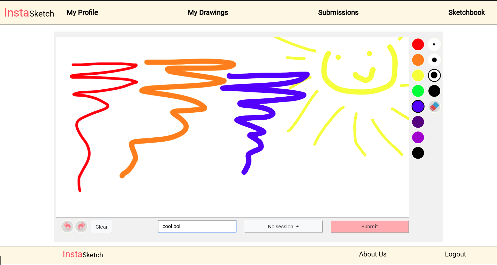
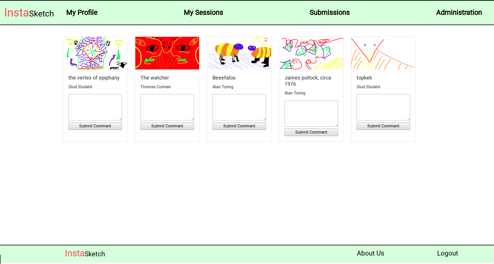
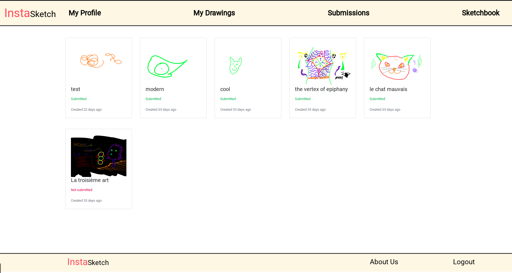

# InstaSketch :pencil: :art:

InstaSketch is a web application created to facilitate primary/elementary school teachers and students by creating an environment to submit and access drawings!

This project was made in Node.js using the [Express](https://expressjs.com) web framework with MongoDB (mongoose), and using the [Fabric.js](http://fabricjs.com) library in the front-end.

# Contributors

* **Juliano Garcia** - [@robotenique](https://github.com/robotenique)
* **Sunmin** - [@Adam5i](https://github.com/kmsunmin)
* **Amritpal Aujla** - [@tjflorashi](https://github.com/Spyguy001)
* **Max Boyko** - [@tjflorashi](https://github.com/maxboyko1)

# Screenshots

<p align="center"> </p>

<p align="center"> </p>

<p align="center"> </p>

Check more screenshots [here](https://github.com/robotenique/instasketch/tree/master/instasketch/assets/images/screenshots).

# Setup

In the **instasketch** folder (the one with *package.json* file) run (in the terminal):

```bash
$ npm install
```

The mongodatabase is located in the cloud, so if you want to change the code or the project to what you want, it's recommended to use a local mongo database.


### Run the application

Make sure that you have the required packages, then run the following command in the *instasketch* folder.

```bash
$ node app.js
```

